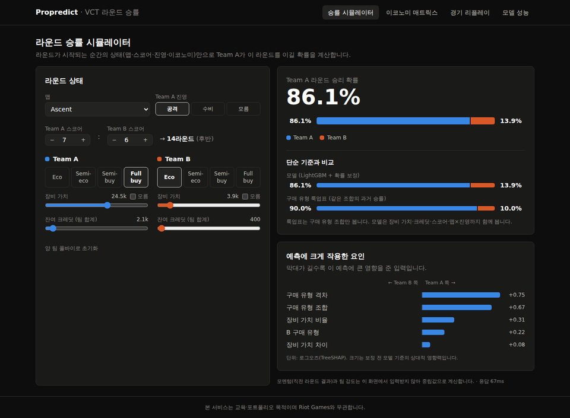
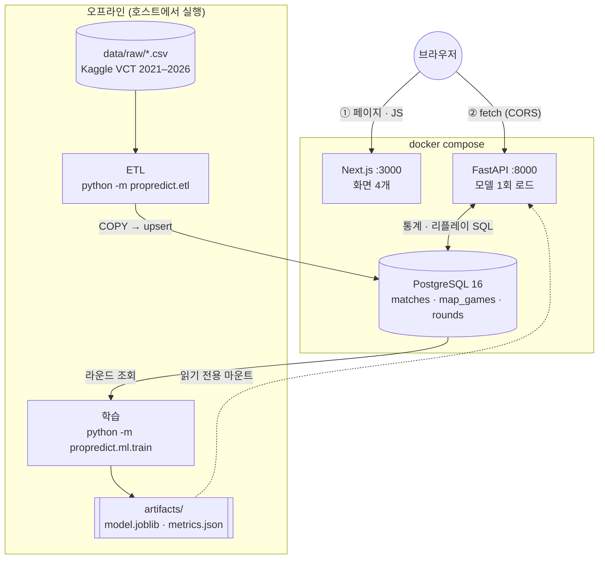
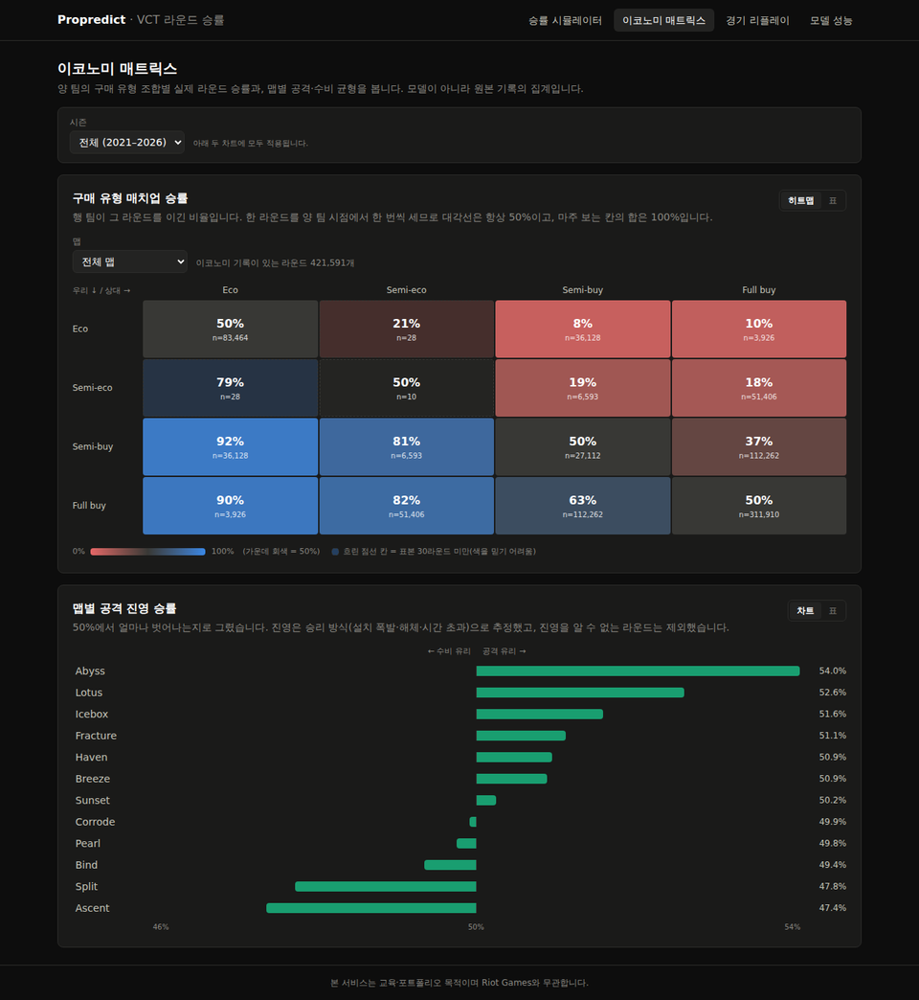
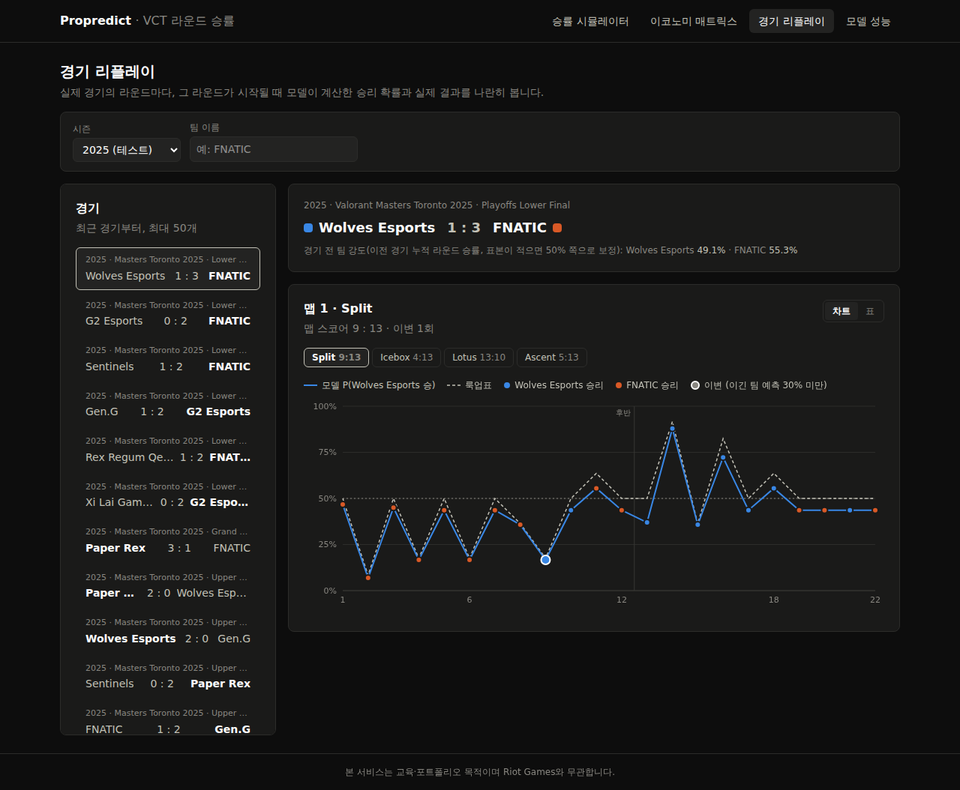
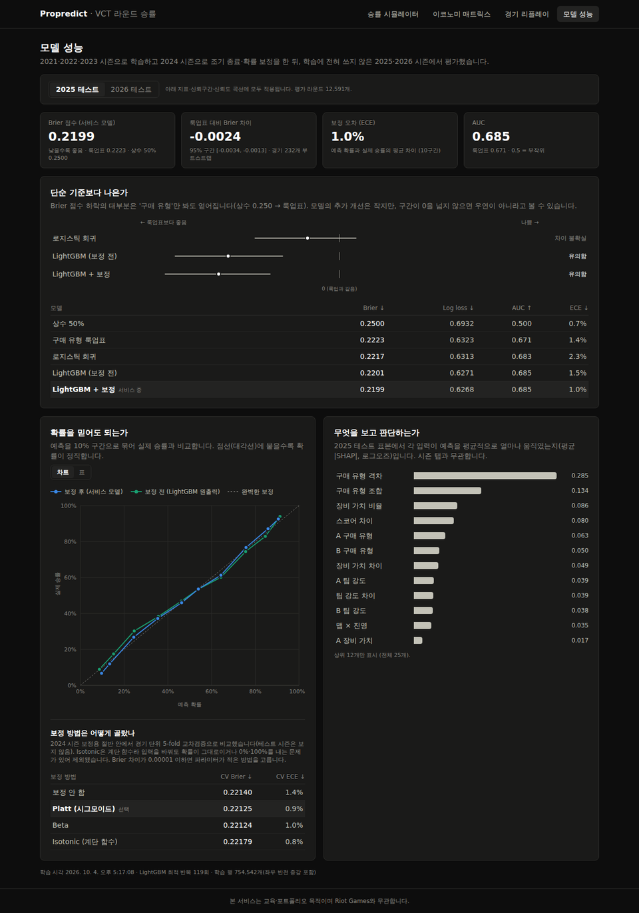

# ProGameMatch_predict-by-data

> **Propredict** — 발로란트 VCT 프로 경기에서 **라운드가 시작되는 시점의 상태**만으로 그 라운드의 승리 확률을 예측하고, 웹에서 탐색하는 서비스.
>
> 본 서비스는 교육·포트폴리오 목적이며 Riot Games와 무관합니다.

## 무엇을 보여 주나

- **확률의 신뢰성(calibration)**: "모델이 70%라고 한 라운드는 실제로 70% 이겼다"를 calibration curve로 증명한다.
- **이코노미의 영향 정량화**: 구매 유형 조합(Eco / Semi-eco / Semi-buy / Full buy)이 라운드 승패에 주는 영향.
- 성능 기준선은 "항상 0.5"와 "구매유형 조합 룩업 테이블" 두 가지다. 모델은 둘 다 이겨야 한다.

## 진행 상황

| Phase | 내용 | 상태 |
|---|---|---|
| 0 | 데이터 감사 → [`reports/data_audit.md`](reports/data_audit.md) | ✅ |
| 1 | 프로젝트 골격 (Docker Compose, DB 마이그레이션, CI) | ✅ |
| 2 | ETL (CSV → PostgreSQL) → [`reports/etl_summary.md`](reports/etl_summary.md) | ✅ |
| 3 | 모델 (피처 · 학습 · 보정 · 누수 방지 테스트) → [`reports/model_comparison.md`](reports/model_comparison.md) | ✅ |
| 4 | API (FastAPI · OpenAPI 문서 · 테스트) | ✅ |
| 5 | 프론트엔드 (시뮬레이터 · 이코노미 매트릭스 · 경기 리플레이 · 모델 성능) | ✅ |
| 6 | 마무리 (보정 방법 개선 · 아키텍처 문서 · 결과 정리) → [`docs/architecture.md`](docs/architecture.md) | ✅ |

## 결과



학습 2021–2023 · 검증 2024 · **테스트 2025, 2026** (시즌 단위 분할이라 테스트 경기는 학습에 전혀 쓰지 않았다). 지표는 Brier score이고, 낮을수록 좋다.

| 테스트 시즌 | 항상 0.5 | 구매유형 룩업표 | LightGBM + Platt 보정 | 룩업 대비 차이 (95% CI) | ECE |
|---|---:|---:|---:|---|---:|
| 2025 | 0.2500 | 0.2223 | **0.2199** | −0.00235 [−0.00341, −0.00134] | 0.95% |
| 2026 (장비가치 전부 결측) | 0.2500 | 0.2222 | **0.2207** | −0.00147 [−0.00228, −0.00065] | 1.49% |

- **예측력의 대부분은 구매유형에서 나온다.** 항상 0.5 → 룩업표로 Brier가 11% 줄고, 모델이 그 위에 더하는 개선은 약 1%p다(11.1% → 12.0%). 작지만 경기 단위 부트스트랩 신뢰구간이 0을 넘지 않아 우연이 아니다.
- **확률을 믿을 수 있다.** 10구간 ECE가 1% 안팎이다. 예를 들어 2025년에 모델이 평균 75.8%라고 한 라운드 782개의 실제 승률은 76.7%였다(화면 4의 신뢰도 곡선).
- **장비가치가 없는 2026년에도 동작한다.** 학습 때 장비가치를 일부러 25% 지워서 구매유형·크레딧만으로 예측하는 경로를 가르쳤다(D14).
- **더 좋아지려면 새 정보가 필요하다.** 하이퍼파라미터 격자 탐색의 차이는 0.0001 이하였다(D16). 라운드 결과는 에임·전술처럼 이 데이터에 없는 요인에 크게 좌우된다.

### 만들면서 고친 것

웹 시뮬레이터에서 스코어를 바꿔도 승률이 87.9%에서 움직이지 않았다. 원인은 isotonic 보정기였다. isotonic은 계단 함수라 원출력이 조금 바뀌어도 같은 계단에 머물고, 표본이 적은 양 끝에서는 0%·100%를 냈다. 테스트 지표에는 거의 드러나지 않던 문제다.

보정 방법을 감으로 바꾸지 않고, 보정용 데이터 안에서 **경기 단위 5-fold 교차검증**으로 후보 4개(보정 안 함 · Platt · Beta · isotonic)를 비교했다. isotonic은 Brier가 보정하지 않은 것보다도 나빴고(과적합), Platt가 선택됐다. 결과적으로 테스트 Brier도 조금 좋아졌고, 출력은 연속이 됐으며(1.6%–98.5%), 같은 문제를 막는 회귀 테스트를 추가했다(D21, D22).

## 아키텍처



ETL 단계, 학습 파이프라인, 예측 요청 흐름, 학습·서빙 공유 코드는 [`docs/architecture.md`](docs/architecture.md)에 다이어그램과 함께 정리했다.

| 영역 | 기술 |
|---|---|
| 언어 / 패키지 | Python 3.11, uv |
| DB / 마이그레이션 | PostgreSQL 16, SQLAlchemy 2, Alembic |
| 모델 | scikit-learn, LightGBM, SHAP |
| API | FastAPI, Pydantic v2 |
| 웹 | Next.js 16 (App Router), TypeScript, Tailwind v4, Recharts |
| 인프라 | Docker Compose, GitHub Actions |

## 빠른 시작

### 준비물
- Docker Desktop
- [uv](https://docs.astral.sh/uv/) (Python 3.11은 uv가 자동으로 받는다)
- Node.js 22 (웹을 로컬에서 개발할 때만)
- macOS에서 Docker 없이 API를 실행할 때: `brew install libomp` (LightGBM이 OpenMP 런타임을 필요로 한다. Docker 이미지에는 들어 있다)

### 1. 데이터 받기

```bash
./scripts/download_data.sh      # kaggle CLI 필요. 방법은 스크립트 상단 주석 참고
```
CLI 없이 [Kaggle 데이터셋 페이지](https://www.kaggle.com/datasets/ryanluong1/valorant-champion-tour-2021-2023-data)에서 zip을 받아 `data/raw/`에 풀어도 된다. 원본 CSV(1.3 GB)는 git에 커밋하지 않는다.

### 2. 전체 스택 실행

```bash
cp .env.example .env            # 선택: 기본값으로도 동작
docker compose up --build
```
- 웹: http://localhost:3000 — 화면 4개는 아래 [6. 웹 화면](#6-웹-화면) 참고
- API 문서(OpenAPI): http://localhost:8000/docs
- DB 스키마는 API 컨테이너가 시작할 때 `alembic upgrade head`로 자동 적용된다.

### 3. 데이터 적재 (ETL)

```bash
docker compose up -d db              # DB만 띄우기
uv run alembic upgrade head          # 스키마 적용
uv run python -m propredict.etl      # 전 시즌 적재 (약 2분). --seasons 2025 2026 으로 일부만 가능
```
몇 번을 다시 실행해도 결과는 같다(멱등). 두 번째 실행부터는 모든 테이블이 `+0 ~0 -0`으로 표시된다.
적재 결과는 matches 12,652 · map_games 27,336 · rounds 555,999다.

### 4. 모델 학습 (선택)

학습된 모델(`artifacts/model.joblib`)이 저장소에 포함돼 있으므로 이 단계 없이도 API가 동작한다. 다시 학습하려면:

```bash
uv run python -m propredict.ml.train   # 약 1분. artifacts/와 reports/model_comparison.md를 갱신
```

결과는 위 [결과](#결과) 표와 같다. 보정 방법 선택 과정과 시즌별 상세 표는 [`reports/model_comparison.md`](reports/model_comparison.md)에 자동 생성된다.


### 5. API

`docker compose up` 후 http://localhost:8000/docs 에서 모든 엔드포인트를 직접 호출해 볼 수 있다(OpenAPI 자동 문서).

| 메서드 | 경로 | 설명 | 실데이터 응답 시간 |
|---|---|---|---:|
| GET | `/api/health` | API·DB·모델 상태 | – |
| GET | `/api/maps` | 맵 목록 + 시즌 목록 | 16ms |
| GET | `/api/teams?season=&q=` | 팀 검색 + 팀 강도 | 19ms |
| POST | `/api/predict` | 라운드 승률 + 룩업표 값 + SHAP 상위 요인 | 33ms |
| GET | `/api/stats/buy-matrix?map=&season=` | 구매유형 4×4 승률 (양 팀 관점 대칭) | 130ms |
| GET | `/api/stats/map-balance?season=` | 맵별 공격 승률 등 | 0.6s |
| GET | `/api/matches?season=&team=` | 리플레이할 경기 목록 *(명세 외 추가)* | 10ms |
| GET | `/api/matches/{id}/rounds` | 경기의 라운드별 예측 확률·실제 승패·업셋 | 66ms |
| GET | `/api/model/metrics` | Brier·LogLoss·AUC·ECE, calibration curve, SHAP 중요도 | 3ms |

```bash
curl -X POST localhost:8000/api/predict -H 'content-type: application/json' -d '{
  "map_name": "Ascent", "round_number": 14, "score_a": 7, "score_b": 6,
  "team_a_buy_type": "Full buy: 20k+", "team_b_buy_type": "Eco: 0-5k",
  "team_a_loadout": 24500, "team_b_loadout": 3900, "team_a_credits": 2100, "team_b_credits": 400,
  "team_a_side": "atk"}'
# → {"win_probability_a": 0.8607, "win_probability_b": 0.1393, "baseline_probability_a": 0.8997, "top_factors": [...]}
```

### 6. 웹 화면

`docker compose up` 후 http://localhost:3000. 모든 화면은 다크 테마이며, 모든 차트에 마우스 툴팁과 표 보기가 있다.

| 화면 | 경로 | 보여 주는 것 |
|---|---|---|
| 승률 시뮬레이터 | `/` | 맵·스코어·진영·양 팀 이코노미를 바꾸면 300ms 디바운스 후 승률·룩업표 비교·SHAP 상위 요인이 갱신된다 (입력 → 화면 갱신 중앙값 335ms, 최대 347ms) |
| 이코노미 매트릭스 | `/economy` | 구매유형 4×4 승률 히트맵(맵·시즌 필터, 표본 30라운드 미만 칸 표시), 맵별 공격 승률의 50% 대비 편차 |
| 경기 리플레이 | `/replay` | 경기 → 맵별 라운드 승률 곡선(모델 vs 룩업표), 실제 승자 점, 이변(이긴 팀 예측 < 30%) 강조, 라운드 표 |
| 모델 성능 | `/model` | 2025/2026 테스트 탭: Brier·ECE·AUC 타일, 룩업 대비 Brier 차이의 95% 신뢰구간, 신뢰도 곡선(보정 전·후), SHAP 중요도 |

| | |
|---|---|
|  |  |
|  |  |

### 7. 로컬 개발

```bash
uv sync                          # 의존성 설치 (.venv)
docker compose up -d db          # DB만 띄우기
uv run alembic upgrade head      # 스키마 적용
uv run pytest                    # 테스트
uv run ruff check . && uv run ruff format --check .
uv run uvicorn propredict.api.main:app --reload   # API 개발 서버 (DB는 docker compose up -d db)
uv run python scripts/audit_data.py   # 데이터 감사 재실행 → reports/data_audit_stats.json

cd web && npm ci && npm run dev  # 웹 개발 서버 (API 주소: NEXT_PUBLIC_API_BASE_URL, 기본 http://localhost:8000)
cd web && npm run typecheck      # 타입 검사
```

## 디렉터리 구조

```
├── src/propredict/      # 단일 Python 패키지: config, db, models(ORM), etl/, ml/, api/
├── migrations/          # Alembic 마이그레이션
├── tests/
├── scripts/             # download_data.sh, audit_data.py
├── web/                 # Next.js 프론트엔드
├── docker/              # api / web Dockerfile
├── data/raw/            # 원본 CSV (git 제외)
├── artifacts/           # 학습된 모델 (API에 읽기 전용 마운트)
├── reports/             # 데이터 감사 · 모델 비교 리포트
├── docs/architecture.md # 아키텍처 다이어그램
└── docs/decisions.md    # 설계 결정 기록 (D1–D22)
```

## 데이터 한계 (요약)

자세한 수치와 근거는 [`reports/data_audit.md`](reports/data_audit.md)에 있다.

- **라운드 진행 중 실시간 승률은 만들 수 없다.** `rounds_kills.csv`는 멀티킬·클러치만 기록하고 타임스탬프가 없다. 선수 단위 집계로만 쓴다.
- **공격/수비 진영은 원본에 직접 없다.** `maps_scores`의 Attacker/Defender 컬럼은 실제로 전·후반 점수다. 진영은 라운드 승리 방식과 하프·연장 교대 규칙으로 역산하며, 라운드의 99.27%에서 확정된다. 나머지는 NULL이다.
- **날짜가 없다.** 시즌(폴더) 단위 순서만 확실하다.
- **이코노미 데이터가 불완전하다.** `eco_rounds`는 맵의 46–100%만 담고 있고, 2026년은 `Loadout Value`가 전부 결측이다.
- **밴픽 커버리지가 낮다.** 2021년 12%, 2022년 33%다.
- **리그 수준이 섞여 있다.** 2023년부터는 1부 리그만 포함하므로 시즌 간 분포가 다르다.

## 다음에 해 볼 것

- **새 정보 추가**: 요원 조합, 선수 로스터 변경, 대회 단계(그룹/플레이오프). D16에서 본 것처럼 병목은 모델이 아니라 정보량이다.
- **팀 강도 개선**: 지금은 이전 경기까지의 누적 라운드 승률(사전분포 보정)이다. Elo처럼 최근 경기에 가중치를 주는 방식과 비교해 볼 수 있다.
- **시즌 내 순서**: 원본에 날짜가 없어 Match ID 순서를 썼다(대진표와 96–99% 일치, D13). 날짜를 확보하면 시즌 안에서도 시간순 분할로 검증할 수 있다.

## 설계 결정

주요 결정 22개와 근거는 [`docs/decisions.md`](docs/decisions.md)에 정리했다. 분할 전략(D1), A/B 반전 증강(D2), 진영 역산(D12), 멱등 ETL(D10), 시간 순서 검증(D13), 학습·서빙 공유(D17), 보정 방법 선택(D22) 등.
