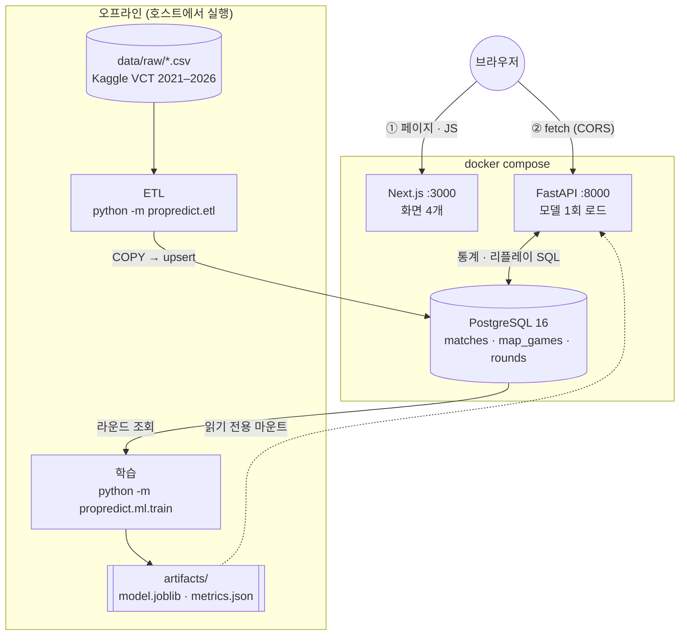
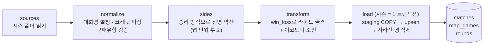
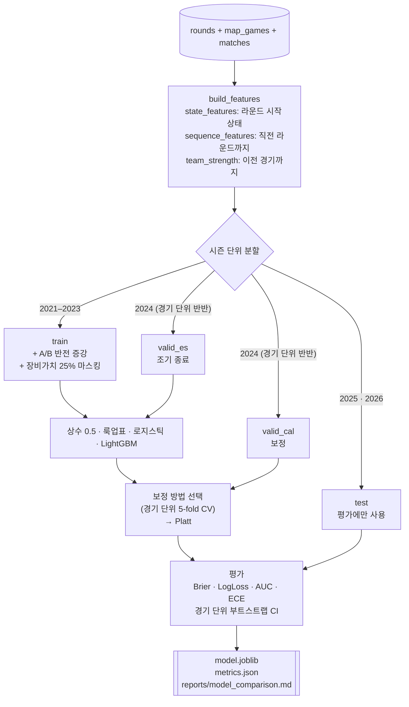
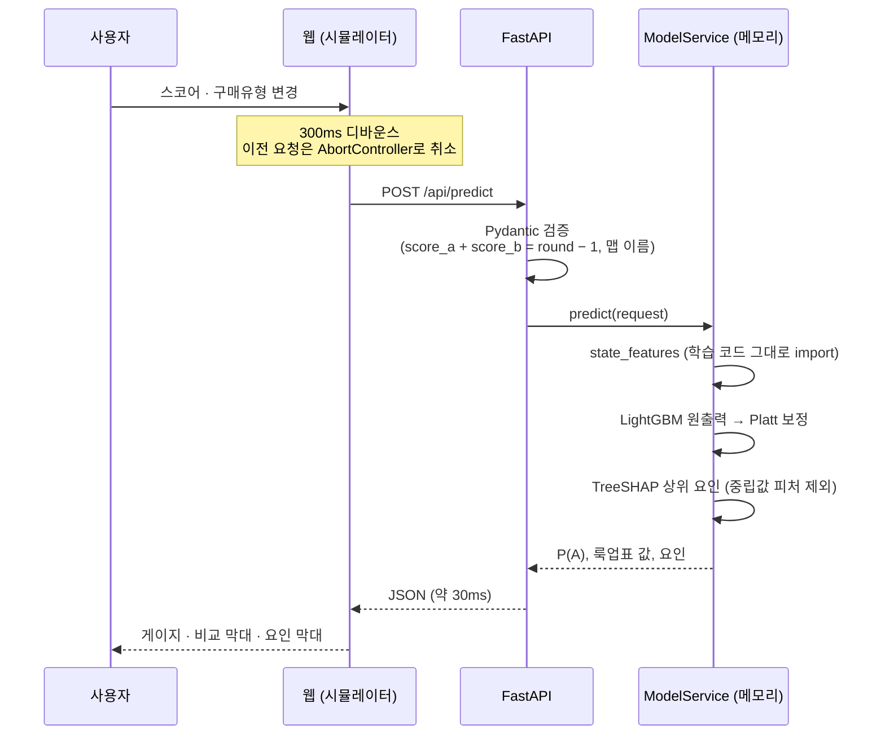

# 아키텍처

Propredict는 **오프라인 단계**(ETL · 학습: 개발자가 실행)와 **온라인 단계**(API · 웹: 사용자가 사용)로 나뉜다.
두 단계를 잇는 것은 PostgreSQL과 학습 산출물(`artifacts/model.joblib`, `artifacts/metrics.json`) 두 가지뿐이다.

## 1. 전체 구성

- **API와 웹은 서로 직접 통신하지 않는다.** 웹은 정적 페이지와 JS만 내려주고, 데이터는 브라우저가 API를 직접 호출한다. 그래서 API 주소(`NEXT_PUBLIC_API_BASE_URL`)는 컨테이너 이름이 아니라 브라우저 기준 주소이고, API는 CORS로 웹 출처만 허용한다.
- **모델은 이미지에 넣지 않고 마운트한다.** 재학습 후 API 컨테이너만 다시 시작하면 새 모델이 적용된다(D8).
- **DB 스키마는 API 컨테이너가 시작할 때 `alembic upgrade head`로 맞춘다**(D7). ETL과 학습은 그 스키마를 전제로 한다.

## 2. ETL: CSV → PostgreSQL

| 단계 | 핵심 결정 | 근거 |
|---|---|---|
| 라운드 골격 | `win_loss`로 모든 라운드를 적재하고 이코노미는 NULL 허용 | 이코노미가 없는 맵도 리플레이·통계에 필요 (D4) |
| 진영 | 결정적 라운드를 하프·연장 규칙으로 환산해 맵 단위 투표 | 원본에 진영 컬럼이 없음. 99.27% 확정, 엇갈리면 NULL (D12) |
| 멱등성 | upsert + `IS DISTINCT FROM` + 삭제 | 재실행해도 대리키가 유지되고 `+0 ~0 -0` (D10) |

## 3. 학습 파이프라인

- **누수 방지**: 시즌 단위 분할로 테스트 경기는 학습에 전혀 쓰지 않는다. 직전 라운드·팀 강도 피처는 `shift(1)`과 '이전 경기까지'의 누적으로만 만든다. 이를 위반하는 코드를 일부러 넣으면 실패하는 테스트(`tests/ml/test_leakage.py`)로 검증했다(D1, D13).
- **증강은 train에만** 적용한다. valid·test에 넣으면 같은 라운드가 두 번 평가된다(D2, D14).
- **선택은 valid로만**: 하이퍼파라미터(D16)와 보정 방법(D22) 모두 테스트 시즌을 보지 않고 골랐다.

## 4. 예측 요청 흐름

입력 변경부터 화면 갱신까지 중앙값 335ms(디바운스 300ms 포함)로, 명세 기준 500ms 이내다(D19).

## 5. 학습과 서빙이 공유하는 것

학습 때와 서빙 때 피처 계산이 조금이라도 다르면(training-serving skew) 테스트 점수는 좋은데 실제 예측은 틀리는 문제가 생긴다. 그래서 같은 코드와 같은 값을 쓴다.

| 공유 대상 | 위치 | 서빙에서 쓰는 곳 |
|---|---|---|
| 라운드 상태 피처 | `ml/features.py: state_features` | `/api/predict` |
| 직전 라운드 피처 | `ml/features.py: sequence_features` | `/api/matches/{id}/rounds` |
| 범주 목록 · 보정기 | `RoundWinModel` (아티팩트 하나에 저장) | 모든 예측 |
| 경기별 팀 강도 | 아티팩트의 `match_strength` (원본 Match ID 키) | 리플레이 (D17) |
| 룩업표 | 아티팩트의 `lookup_table` | 예측 응답의 비교 값 |
| 지표 | `metrics.json` | `/api/model/metrics`, 리포트 |

## 6. 품질 장치

| 장치 | 내용 |
|---|---|
| 테스트 | pytest 71개: ETL(진영 역산·멱등성), 피처 누수, 보정기 성질, API(검증·지연·대칭·계단 출력 회귀) |
| CI (GitHub Actions) | ruff, 실제 PostgreSQL 16에서 마이그레이션 upgrade → drift check → downgrade → upgrade, pytest, 웹 typecheck · build, Docker 이미지 빌드 |
| 재현성 | uv.lock · package-lock.json 고정, 시드 42, 리포트는 학습 결과에서 자동 생성 |
